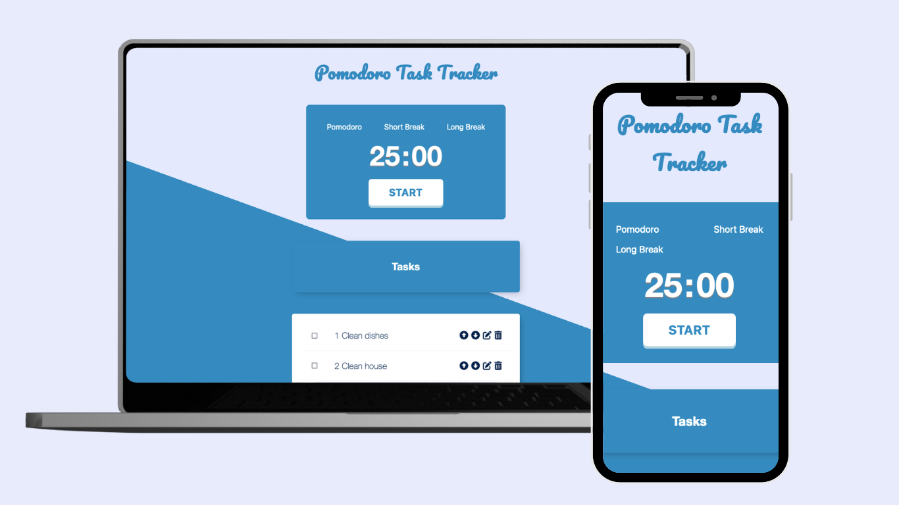

# Pomodoro Task Tracker

A Pomodoro Task Tracker built using the MVC Architecture. The app also implements "authorization" so anyone can sign up and set tasks on their own account

## How It's Made

**Tech**: bcrypt, connect-mongo, dotenv, ejs, express, express-flash, express-session, mongodb, mongoose, morgan, nodemon, passport, passport-local, validator

This app was created using MVC architecture. The server was created using ExpressJS and the database used was MongoDB. Validation and user authentication was handled using PassportJs. Many of the operations to handle the tasks were created using CRUD principles.

The app is also responsive to various screen sizes

## Optimizations

I plan to change the sorting of tasks to improve the speed of the operation. Currently, tasks are sorted by user selected priority within the User Model. I may change this to allow Mongoose to do the sorting once more research on the speed of the two methods are done.

## Lessons Learned

I've learned how MVC is used to organize code as well as how requests and responses move between the client and the server. I've been able to update a database using CRUD methods and display this data using EJS as my HTML templating language. Additionally, I've learned how to use passportJs and bcrypt to create users on the database and hash their passwords for user safety and privacy

## Check out my Other Work

[InstaPrep](https://github.com/jonathanmani/InstaPrep) - Your meals should be an accident. Plan them in minutes with InstaPrep

[DailyUI](https://github.com/jonathanmani/DailyUI) - A collection of Front End designs made using TailwindCss and React

[My Pocket Dictionary](https://github.com/jonathanmani/Dictionary) - A minimalist dictionary app that uses the Merriam-Webster API
